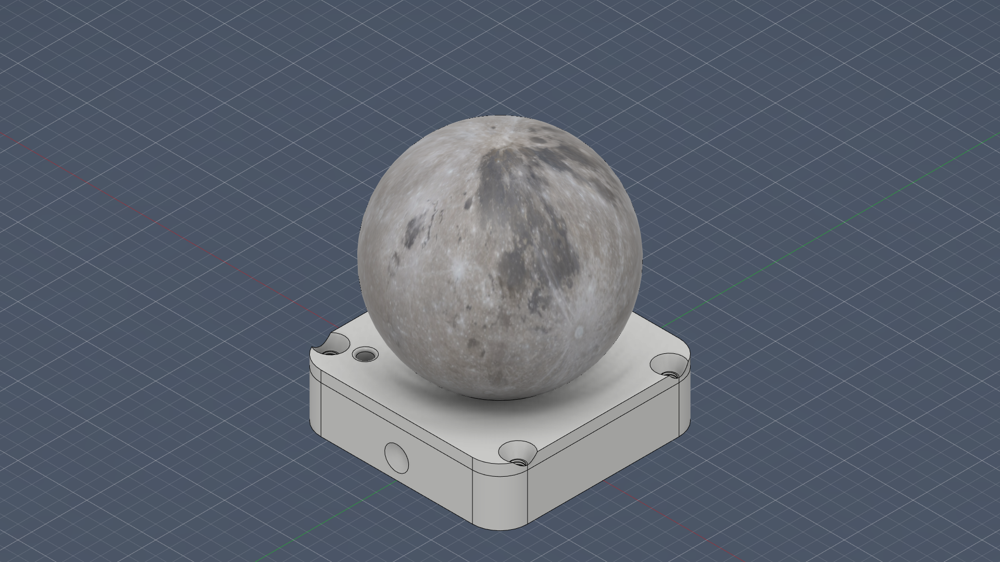
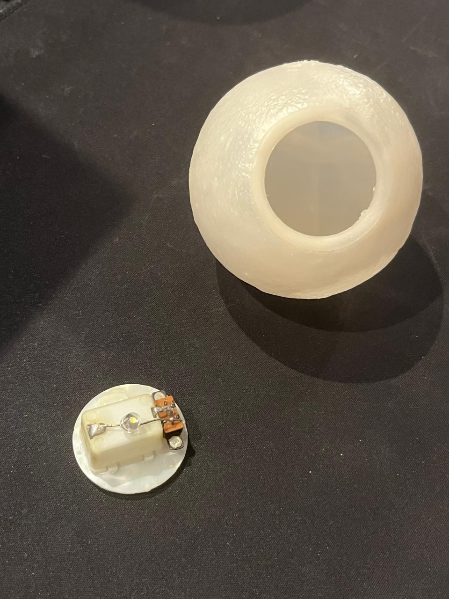
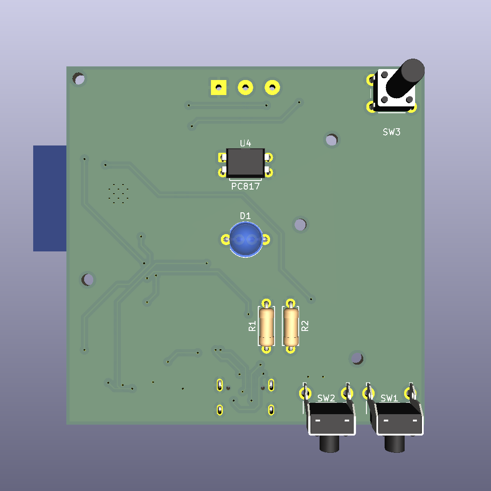
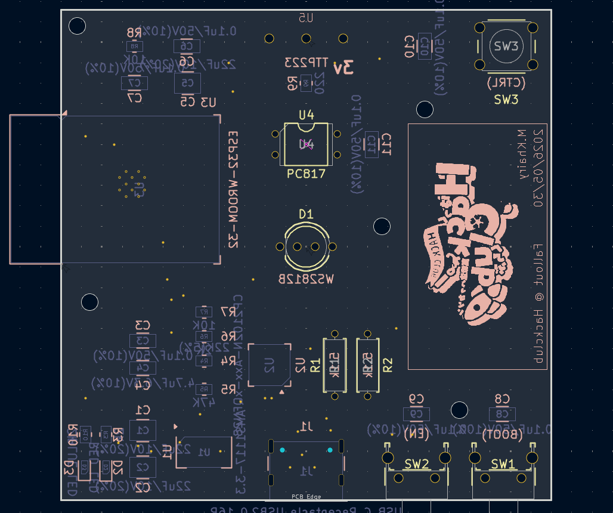
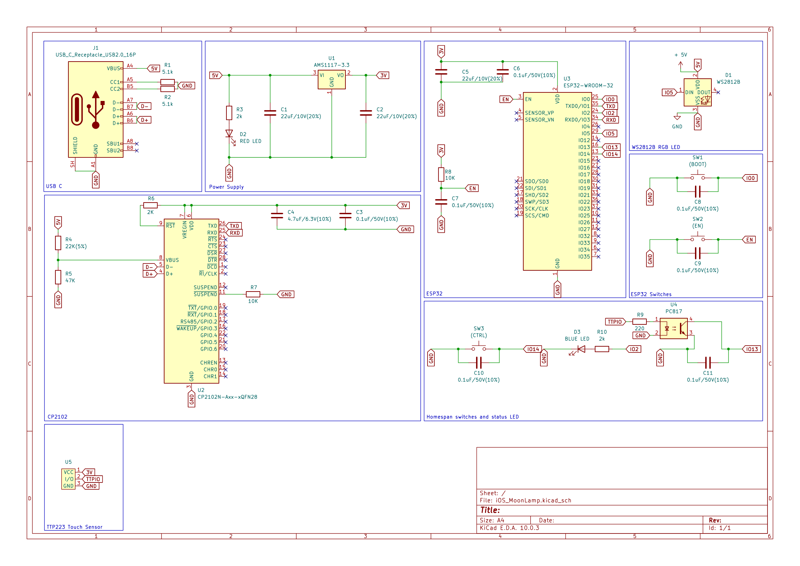
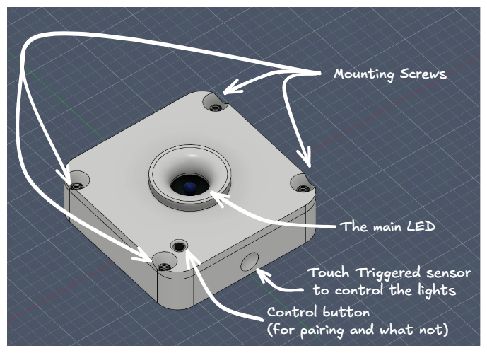
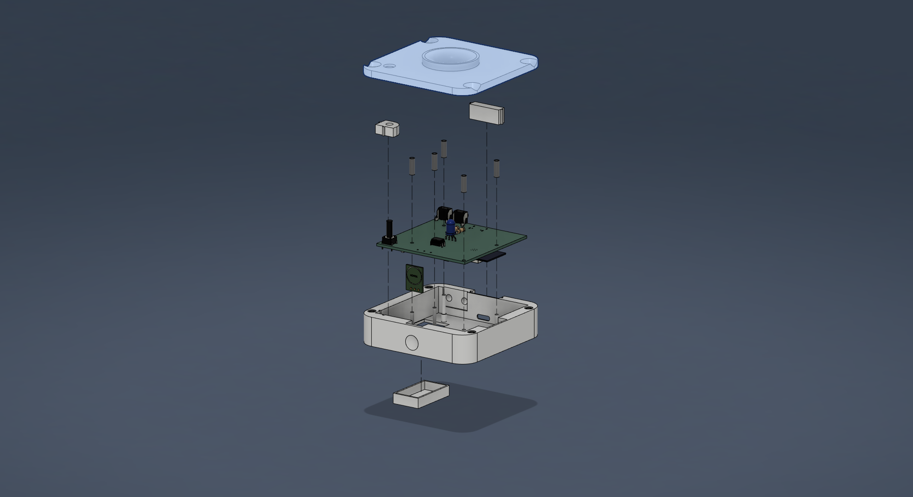

# iOS Moon Lamp

Bought a battery powered Moon lamp a few years ago, and it was cool back then but now it’s boring that I have to turn it on and off manually every night. So I removed the insides of it and made it powered with an ESP32 controlled by the iOS Home app.

## The Design

### The PCB:
Here's how the PCB looks like:

And here's the gerber view for it:

### The Schematics:

### The case:

## Assembly
### Exploded View:

### Assembly video:
This video shows how to assemble and disassemble the case:

https://github.com/user-attachments/assets/3fa87b10-48f1-4240-b7dd-df9781dbfde8

## BOM
Available as a .csv file [here](./BOM/BOM.csv)
|Name             |Value         |Link                                                                                                        |Cost (EGP)  |Qty|Description           |
|-----------------|--------------|------------------------------------------------------------------------------------------------------------|------------|---|----------------------|
|Capacitor        |22uF          |https://lampatronics.com/product/smd-multilayer-ceramic-capacitor-1210-22uf-16v-1pcs                        | EGP 2.00   |3  |                      |
|Capacitor        |100nf         |https://lampatronics.com/product/smd-multilayer-ceramic-capacitor-1206-100nf-50v-1pcs                       | EGP 1.50   |7  |                      |
|Capacitor        |4.7uF         |https://lampatronics.com/product/smd-multilayer-ceramic-capacitor-1206-4-7uf-16v-1pcs                       | EGP 1.50   |1  |                      |
|Main LED         |WS2812B LED   |https://uge-one.com/product/f5-5mm-ws2812b-rgb-smart-led-5v/                                                | EGP 17.10  |1  |                      |
|Power LED        |RED LED       |https://lampatronics.com/product/smd-led-0603-red-10pcs                                                     | EGP 6.00   |1  |                      |
|Status LED       |BLUE LED      |https://lampatronics.com/product/smd-led-0603-blue-10pcs                                                    | EGP 6.00   |1  |                      |
|USB-C            |16P           |https://www.ram-e-shop.com/shop/usb9-c-type-pcb-usb-connector-on-pcb-c-type-type-female-16-pin-sku-usb9-8125| EGP 5.00   |1  |                      |
|Resistor         |5.1k ohm      |https://lampatronics.com/product/resistor-5-1k-ohm-1-4w-2pcs                                                | EGP 0.30   |1  |1 pack of 2 resistors |
|Resistor         |2k            |https://lampatronics.com/product/smd-resistor-2kohm-202-0805-10pcs                                          | EGP 2.00   |1  |1 pack of 10 resistors|
|Resistor         |22k           |https://lampatronics.com/product/smd-resistor-22kohm-223-0805-10pcs                                         | EGP 2.00   |1  |1 pack of 10 resistors|
|Resistor         |47k           |https://lampatronics.com/product/smd-resistor-47k-473-ohm-0805-10pcs                                        | EGP 2.00   |1  |1 pack of 10 resistors|
|Resistor         |10k           |https://lampatronics.com/product/smd-resistor-10kohm-103-0805-10pcs                                         | EGP 2.00   |1  |1 pack of 10 resistors|
|Resistor         |220           |https://lampatronics.com/product/smd-resistor-220ohm-221-0805-10pcs                                         | EGP 2.00   |1  |1 pack of 10 resistors|
|Switch           |              |https://lampatronics.com/product/push-button-long-right-angle-2pin2base-7x7-5x6mm                           | EGP 1.50   |1  |Boot and Enable       |
|Switch           |              |https://lampatronics.com/product/push-button-4pin-long-6x6x13mm                                             | EGP 1.50   |1  |Control               |
|Voltage Regulator|AMS1117-3.3   |https://lampatronics.com/product/ams1117-adj-sot-223-adj-linear-voltage-regulator                           | EGP 2.00   |1  |                      |
|Programmer chip  |CP2102N       |https://uge-one.com/product/cp2102-gmr-usb-to-uart-bridge-controller-qfn-28/                                | EGP 250.00 |1  |                      |
|Main MCU         |ESP32-WROOM-32|https://uge-one.com/product/espressif-esp32-wroom-32-dual-core-wi-fi-bluetooth-iot-module/                  | EGP 290.00 |1  |                      |
|Optocoupler      |PC817         |https://www.ram-e-shop.com/shop/pc817-pc817-el817c-f-5866                                                   | EGP 2.00   |1  |                      |
|Touch sensor     |TTP223        |https://lampatronics.com/product/ttp223-touch-button-module                                                 | EGP 10.00  |1  |                      |

> Guides on how to use the control button and identify the device's status using the led is coming soon.

